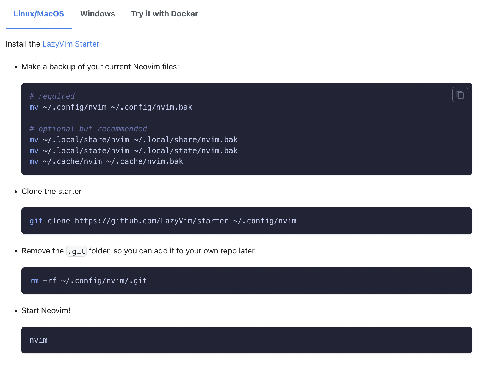
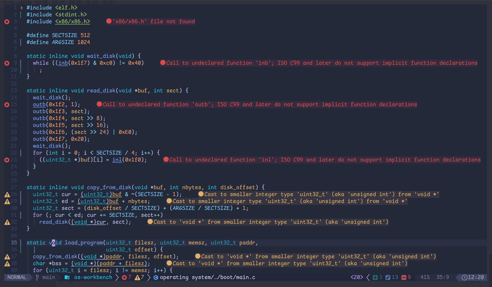

## Lazyvim

**LazyVim doc:** [here](https://www.lazyvim.org/)  

**Reference video：**[bilibili](https://www.bilibili.com/video/BV1ds4y1P7Rs/?spm_id_from=333.880.my_history.page.click)

**Screenshot of the Installation Page:**

**Finished product pictures**

##  shortcut key

[**Use other people's shortcut key configuration**](github.com/bryant-video/neovim-tutorial)

### Open and Close Files

| Mode | Shortcut | Description                                               |
| ---- | -------- | --------------------------------------------------------- |
| `n`  | `:w`     | Write(save) current buffer                                |
| `n`  | `:q`     | Close current buffer (would fail if you don't save first) |
| `n`  | `:wq`    | Save and close current buffer                             |
| `n`  | `:q!`    | Exit current buffer without saving                        |
| `n`  | `:qa!`   | Exit all open buffers without saving                      |
| `n`  | `:wqa`   | Save and exit all open buffers                            |

### Navigation

| Mode     | Shortcut                         | Description                                                  |
| -------- | -------------------------------- | ------------------------------------------------------------ |
| `n`, `v` | `h`                              | Move left                                                    |
| `n`, `v` | `j`                              | Move down                                                    |
| `n`, `v` | `k`                              | Move up                                                      |
| `n`, `v` | `l`                              | Move right                                                   |
| `n`, `v` | `w`                              | One word forward                                             |
| `n`, `v` | `b`                              | One word backward                                            |
| `n`, `v` | `^`                              | Beginning of line                                            |
| `n`, `v` | `$`                              | End of line                                                  |
| `n`, `v` | `gg`                             | Beginning of file                                            |
| `n`, `v` | `G`                              | End of file                                                  |
| `n`, `v` | `{`                              | One paragraph backward                                       |
| `n`, `v` | `}`                              | One paragraph forward                                        |
| `n`, `v` | `f` + `[char]`                   | Move to next occurence of `[char]` in current line (Covered in Part 2 video) |
| `n`, `v` | `F` + `[char]`                   | Move to prev occurence of `[char]` in current line (Covered in Part 2 video) |
| `n`, `v` | `Ctrl`+`u`                       | Move Up half a Page (Covered in Part 2 video)                |
| `n`, `v` | `Ctrl`+`d`                       | Move Down half a Page (Covered in Part 2 video)              |
| `n`, `v` | `Ctrl`+`b`                       | Move Up a Full Page (Covered in Part 2 video)                |
| `n`, `v` | `Ctrl`+`f`                       | Move Down a Full Page (Covered in Part 2 video)              |
| `n`      | `:[num-of-line]` + `Enter`       | Go to a specific line                                        |
| `n`, `v` | `/[search-item]` + `Enter` + `n` | Find pattern and go to next match                            |

### Enter `INSERT` Mode from `NORMAL` Mode

| Mode | Shortcut             | Description                                                  |
| ---- | -------------------- | ------------------------------------------------------------ |
| `n`  | `i`                  | Insert before cursor                                         |
| `n`  | `a`                  | Append after cursor                                          |
| `n`  | `I`                  | Insert at the beginning of the line                          |
| `n`  | `A`                  | Append at the end of the line                                |
| `n`  | `o`                  | Insert to next line                                          |
| `n`  | `O`                  | Insert to previous line                                      |
| `n`  | `c` + `[Navigation]` | Delete from before the cursor to `[Navigation]` and insert. Examples are as follow |
| `n`  | `c` + `w`            | Delete from before the cursor to end of current word and insert |
| `n`  | `c` + `i` + `w`      | Delete current word and insert                               |
| `n`  | `c` + `$`            | Delete from before the cursor to end of the line and insert  |
| `i`  | `<Esc>`              | Go back to Normal Mode, remap to `jk` recommended            |

### Enter `INSERT` Mode from `NORMAL` Mode

| Mode | Shortcut             | Description                                                  |
| ---- | -------------------- | ------------------------------------------------------------ |
| `n`  | `i`                  | Insert before cursor                                         |
| `n`  | `a`                  | Append after cursor                                          |
| `n`  | `I`                  | Insert at the beginning of the line                          |
| `n`  | `A`                  | Append at the end of the line                                |
| `n`  | `o`                  | Insert to next line                                          |
| `n`  | `O`                  | Insert to previous line                                      |
| `n`  | `c` + `[Navigation]` | Delete from before the cursor to `[Navigation]` and insert. Examples are as follow |
| `n`  | `c` + `w`            | Delete from before the cursor to end of current word and insert |
| `n`  | `c` + `i` + `w`      | Delete current word and insert                               |
| `n`  | `c` + `$`            | Delete from before the cursor to end of the line and insert  |
| `i`  | `<Esc>`              | Go back to Normal Mode, remap to `jk` recommended            |

### Edit in `NORMAL` Mode

| Mode | Shortcut                                    | Description                                                  |
| ---- | ------------------------------------------- | ------------------------------------------------------------ |
| `n`  | `dd`                                        | Delete(cut) current line                                     |
| `n`  | `d` + `[Number]` + `d` Or `[Number]` + `dd` | Delete(cut) following `[Number]` of lines                    |
| `n`  | `d` + `[Navigation]`                        | Delete(cut) from before the cursor to `[Navigation]`, similar to `c` + `[Navigation]` above |
| `n`  | `yy`                                        | Yank(copy) current line                                      |
| `n`  | `y` + `[Number]` + `y` Or `[number]` + `yy` | Yank(copy) following `[Number]` of lines                     |
| `n`  | `y` + `[Navigation]`                        | Yank(copy) from before the cursor to `[Navigation]`, similar to `c` + `[Navigation]` above |
| `n`  | `p`                                         | Paste from what you delete or yank                           |
| `n`  | `x`                                         | Delete(cut) the character under the cursor                   |
| `n`  | `u`                                         | Undo changes                                                 |
| `n`  | `Ctrl`+`r`                                  | Redo changes                                                 |
| `n`  | `:%s/[foo]/[bar]/g`                         | Find each occurrence of `[foo]` (in all lines), and replace it with `[bar]`. More substitute commands [here](https://vim.fandom.com/wiki/Search_and_replace). |

---

### Keyboard Shortcuts I Use

| Package                | Shortcut      | Description                                                  |
| ---------------------- | ------------- | ------------------------------------------------------------ |
| General                | `<leader>sx`  | Close current window                                         |
| AutoCompletion General | `Tab`         | Go to next suggestion                                        |
| `Nvim-Tree`            | `<leader>e`   | Tree Toggle                                                  |
| `Nvim-Tree`            | `o`           | Open a folder or a file                                      |
| `Nvim-Tree`            | `v`           | Open another file to the right                               |
| `Nvim-Tree`            | `a`           | Add a new file in the current directory                      |
| `Nvim-Tree`            | `r`           | Rename file under the cursor                                 |
| `Nvim-Tree`            | `d`           | Delete file under the cursor                                 |
| `Comment`              | `gcc`         | Comment/Uncomment current line                               |
| `Comment`              | `gc5j`        | Comment/Uncomment next 5 line                                |
| `Vim-Surround`         | `ysiw"`       | Surround the word under cursor with `"`, remember `iw` is a text object |
| `Telescope`            | `<leader>ff`  | Find files in current working director                       |
| `Telescope`            | `<leader>fs`  | Find string in current working directory                     |
| `Telescope`            | `<leader>lds` | Lsp document symbols. Show all functions, structs, class, modules in current files |
| `Telescope`            | `<leader>gc`  | List all git commits                                         |
| `Telescope`            | `<leader>gs`  | List current changes per file with diff views                |
| `Telescope`            | `Ctrl`+`c`    | Close Telescope window while in `INSERT` mode                |
| `Vim-Maximizer`        | `<leader>sm`  | Maximize/Unmaximize current window the cursor is on          |
| `Hop`                  | `<leader>hc`  | HopChar2, Type 2 chars and then jump to the match you want   |
| `Hop`                  | `<leader>hcc` | HopChar2MW, Same as above, but in multiple windows           |

---

### Keyboard Shortcuts I Use

| Package                 | Shortcut     | Description                                             |
| ----------------------- | ------------ | ------------------------------------------------------- |
| `Lsp config / Lsp saga` | `gd`         | Peek Definition of object/function under cursor         |
| `Lsp config / Lsp saga` | `q`          | Quit Peek Definition while in `NORMAL` mode             |
| `Lsp config / Lsp saga` | `gD`         | Go to Declaration of object/function under cursor       |
| `Lsp config / Lsp saga` | `Ctrl + o`   | Go back to prev buffer(Ex. Go back from Declaration)    |
| `Lsp config / Lsp saga` | `Ctrl + i`   | Go to next buffer                                       |
| `Lsp config / Lsp saga` | `gr`         | Show all References of the object/function under cursor |
| `Lsp config / Lsp saga` | `K`          | Show Documentation under the cursor                     |
| `Lsp saga`              | `]d`         | Go to next diagnostic                                   |
| `Lsp saga`              | `[d`         | Go to prev diagnostic                                   |
| `Lsp saga`              | `<leader>rn` | Rename a variable/class/struct                          |
| `Lsp saga`              | `<leader>tt` | Open a Floating Terminal                                |
| `trouble`               | `<leader>xd` | Open diagnostic for current file                        |
| `trouble`               | `q`          | quit trouble diagnostic while in `NORMAL` mode          |

### Edit in `NORMAL`

| Package        | Shortcut                      | Description                                                  | Remap Needed?      |
| -------------- | ----------------------------- | ------------------------------------------------------------ | ------------------ |
| Vim            | `gb`                          | Mutlicursor operation                                        |                    |
| VScode         | `Ctrl+n`                      | Rename all the pattern that is under the cursor              | `keybindings.json` |
| Vim Commentary | `gcc` / `gc5j`                | Toggle comment on this line / next 5 line(not including current line) |                    |
| EasyMotion     | `<leader><leader>s+[char]`    | Quick navigation to `[char]` on the screen(more motion on doc) |                    |
| Vim-surround   | `ys[motion][symbol]`, `ysiw)` | Yank `[symbol]` around `[motion]`, the example means surround the word under the cursor with `()` |                    |
| Vim-surround   | `cs[symbol][newsymbol]`       | Change `[symbol]` to `[newsymbol]` when your cursor is within the `[symbol]` |                    |
| Vim Sneak      | `<operator>z<char><char>`     | Do `[operator]` until the next occurence of `<char><char>`   |                    |
| Vim Sneak      | `3dzqt`                       | An example: Delete everything until the next 3rd occurence of `qt` |                    |

